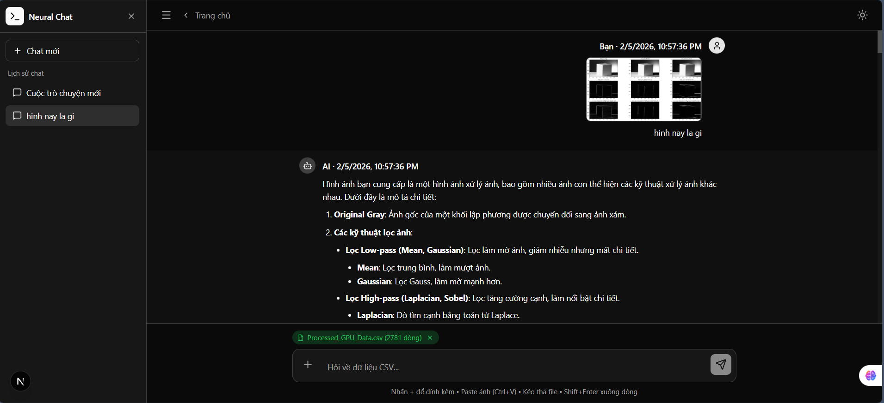
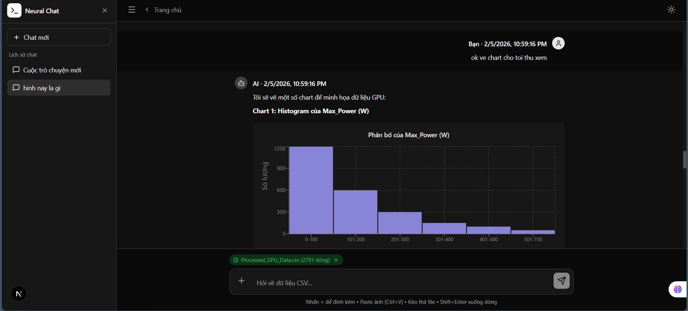
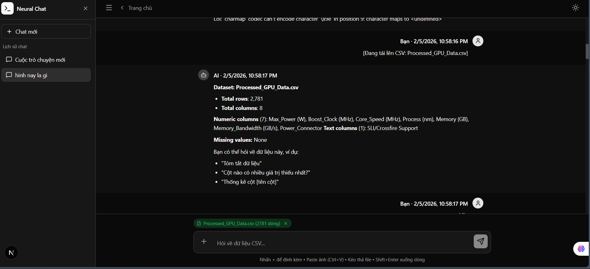
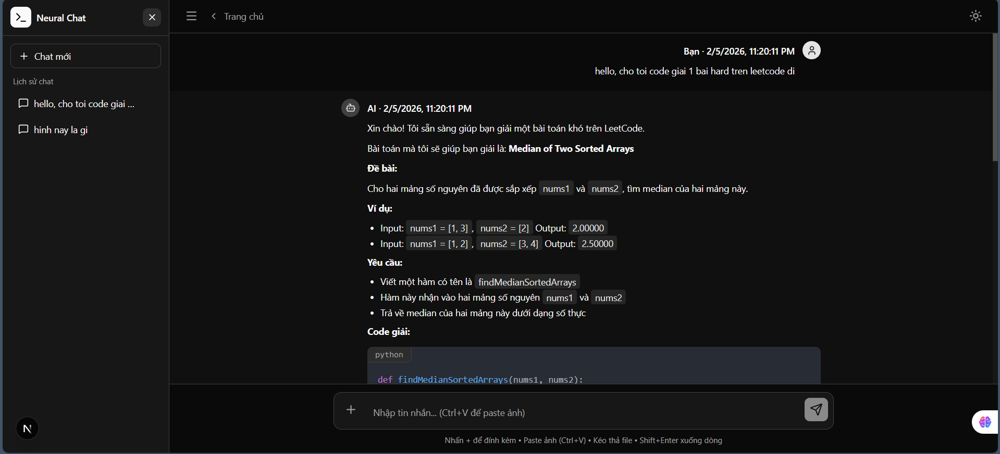
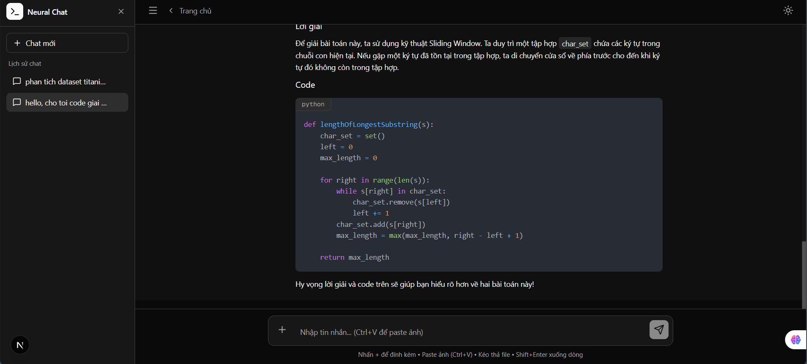
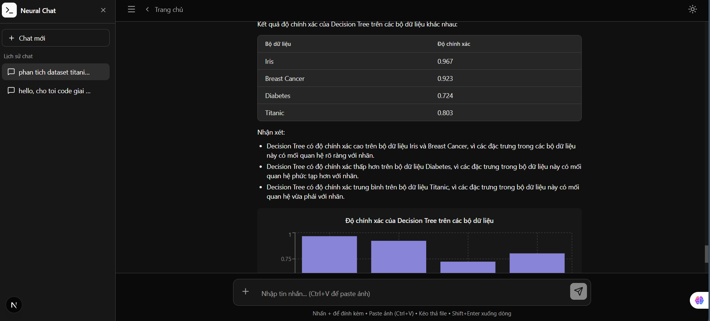

# Neural Chat - AI Chat Application

A versatile AI chat application with image analysis, CSV data processing, and support for various rich content formats.

I'm want to extend with more features like RAG (Graph RAG for chating with Arxiv Paper), Chat with PDF, AI hunger Game (for fun),.. but I'm currently learning more.

I received this assignment on Monday and manage to finish it before sunday.

Here is the deployed website.

Link Deploy: https://multimodal-chatbot-one.vercel.app

- Frontend: Vercel

- Backend: Railway

- Demo Materials: https://github.com/HeroKeyboardUT/multimodal-chatbot/tree/main/frontend/public/demo

- Demo CSV Link: https://raw.githubusercontent.com/HeroKeyboardUT/multimodal-chatbot/main/frontend/public/demo/Processed_GPU_Data.csv

## AI usage and workflow

I utilize GitHub Copilot and Gemini as my primary coding assistants.

- Architecture & Learning: I used AI to analyze open-source patterns (specifically studying the architecture of ii-agent) to understand how to structure the framework effectively.

- Design & Logic: I personally designed the UI layout and mapped out the data flow between the frontend and backend. I also spent time researching and experimenting with the more Chatbot APIs to ensure smooth integration.

Implementation: While AI generated the majority of the code syntax, I focused on adjusting some part of the codebase to be more suitable and debugging the connection flow between components.

## Completed Features

### 1. Chat with AI (Streaming)

- **Multi-turn conversation**: Supports multi-turn conversations with maintained context
- **Streaming response**: Real-time responses, displaying each character as the AI replies
- **Session management**: Manage multiple chat sessions, store chat history

### 2. Markdown Rendering

- **Syntax Highlighting**: Code blocks with language-specific highlighting (Python, JavaScript, TypeScript, etc.)
- **LaTeX Math**: Supports mathematical formulas with KaTeX (`$inline$` and `$$block$$`)
- **Mermaid Diagrams**: Render flowcharts and sequence diagrams
- **HTML Preview**: Preview HTML with a toggle button
- **SVG Rendering**: Directly display SVG
- **JSON Viewer**: Format and highlight JSON data
- **Copy Button**: Quick copy button for each code block

### 3. Image Upload & Analysis

- **Image upload**: Supports PNG, JPG, WEBP, GIF
- **Paste image**: Paste images directly from clipboard (Ctrl+V)
- **Vision AI**: Analyze image content with Llama 4 Scout (Groq)

### 4. CSV Upload & Analysis

- **Upload CSV**: Upload CSV files for analysis
- **Load from URL**: Load CSV from a web link
- **Auto-analysis**: Automatically calculate statistics (mean, median, min, max, std)
- **Data context**: AI can answer questions about CSV data

### 5. UI/UX

- **Dark/Light mode**: Switch between light and dark themes
- **Responsive design**: Compatible with both mobile and desktop
- **Session sidebar**: Manage multiple chat sessions
- **Clean monochrome design**: Minimalist, professional interface

---

## My Thoughts on Building Neural Chat

Building Neural Chat has been an exciting journey of integrating advanced AI capabilities into a user-friendly interface. Leveraging the power of Llama 4 Scout through Groq API allowed me to create a versatile assistant capable of handling diverse inputs like text, images, and CSV data for free.

The challenge was not only in implementing these features but also in ensuring a seamless user experience with real-time streaming and context-aware responses. This project has deepened my understanding of AI technologies and web development. Although the code may not be perfect and is still hard to scale up due to my limited experience, I can say that I have learned a lot through this process and I'm excited to continue.

**P/S:** I spent more than 10 hours (10-15h) on this (including learning new techniques).

---

## Demo Images

<div align="center">
  
  
  
  
  
  
</div>

---

## Demo Video

[Watch Demo Video](https://multimodal-chatbot-one.vercel.app/demo/clip.mp4)

<!-- HTML video tag (may not play on GitHub, but works on some platforms) -->
<video src="https://multimodal-chatbot-one.vercel.app/demo/clip.mp4" controls width="600" poster="https://multimodal-chatbot-one.vercel.app/demo/1.png">
  Your browser does not support the video tag.
</video>

## Technical Limitations

### 1. File Size Limits

| File Type | Limit | Reason                                                                                                                                     |
| --------- | ----- | ------------------------------------------------------------------------------------------------------------------------------------------ |
| **Image** | 10 MB | Images are encoded as Base64 (increases size by ~33%) and stored in the database. Large images slow down API response and use more memory. |
| **CSV**   | 5 MB  | CSV is parsed to JSON and kept in memory. Large files may cause timeout or out-of-memory errors.                                           |

### 2. Message History

| Aspect                  | Value              | Reason                                                                                           |
| ----------------------- | ------------------ | ------------------------------------------------------------------------------------------------ |
| **Storage duration**    | Permanent (SQLite) | SQLite database stores locally, does not auto-delete                                             |
| **Messages sent to AI** | 15 most recent     | LLM API token limit (~8K-32K tokens). Sending too much history exceeds the limit and costs more. |
| **UI display**          | All                | Frontend loads all from localStorage                                                             |

### 3. Image Limitations

| Aspect      | Value               | Reason                                          |
| ----------- | ------------------- | ----------------------------------------------- |
| **Formats** | PNG, JPG, WEBP, GIF | Popular formats supported by LLM vision         |
| **Storage** | Base64 in SQLite    | No need for file system, easy to backup/migrate |

### 4. CSV Limitations

CSV file must be easy for pd to parse, similar to the file given in demo.
CSV can't be sent in the same message with text, because of some mistake in
the database and backend design.

| Aspect              | Value          | Reason                             |
| ------------------- | -------------- | ---------------------------------- |
| **Displayed rows**  | First 100      | Reduce payload sent to frontend    |
| **Rows in context** | 1000 rows      | Limit memory and tokens sent to AI |
| **Encoding**        | UTF-8, Latin-1 | Most common encodings              |

### 5. AI Model

| Model                 | Purpose              | Limitation          |
| --------------------- | -------------------- | ------------------- |
| **Llama 4 Scout 17B** | Chat + Vision        | Groq API rate limit |
| **Llama 3.3 70B**     | Fallback (text only) | No image support    |

---

## Project Structure

```
ii-assignment/
├── frontend/                 # Next.js 16 + React 19
│   ├── app/
│   │   ├── chat/            # Main chat page
│   │   ├── components/      # React components
│   │   ├── services/        # API client
│   │   └── types/           # TypeScript types
│   └── package.json
│
├── backend/                  # FastAPI + Python
│   ├── api/routes/          # API endpoints
│   │   ├── chat.py          # Chat streaming
│   │   ├── image.py         # Image upload
│   │   └── csv.py           # CSV processing
│   ├── services/
│   │   ├── llm_service.py   # Groq AI integration
│   │   └── csv_service.py   # CSV parsing
│   ├── database/
│   │   ├── models.py        # SQLAlchemy models
│   │   └── repository.py    # CRUD operations
│   └── requirements.txt
│
└── README.md
```

## Local Setup Guide

### 1. Clone the Repository

```bash
git clone https://github.com/your-username/ii-assignment.git
cd ii-assignment
```

---

### 2. Backend Setup

#### a. Create and Activate Virtual Environment

```bash
cd backend
python -m venv venv
# On Windows:
venv\Scripts\activate
# On Linux/Mac:
source venv/bin/activate
```

#### b. Install Python Dependencies

```bash
pip install -r requirements.txt
```

#### c. Create `.env` File

Create a file named `.env` in the `backend` folder with the following content:

```
GROQ_API_KEY=your_groq_api_key_here
```

- Replace `your_groq_api_key_here` with your actual Groq API key.
- You can get a free Groq API key at: https://console.groq.com/keys

#### d. Run the Backend Server

```bash
uvicorn main:app --reload
```

The backend will be available at: [http://localhost:8000](http://localhost:8000)

---

### 3. Frontend Setup

```bash
cd ../frontend
npm install
```

#### (Optional) Create `.env.local` for Frontend

If you want to customize the API endpoint, create a `.env.local` file in the `frontend` folder:

```
NEXT_PUBLIC_API_URL=http://localhost:8000
```

- By default, the frontend will call the backend at `http://localhost:8000`.

#### Start the Frontend

```bash
npm run dev
```

The frontend will be available at: [http://localhost:3000](http://localhost:3000)

---

#### 4. Start all

At root directory:

```bash
npm start
```

---

### 5. Access the App

Open your browser and go to [http://localhost:3000](http://localhost:3000) to use Neural Chat locally.

---

### Troubleshooting

- Make sure both backend and frontend are running.
- If you see CORS errors, check that `NEXT_PUBLIC_API_URL` in the frontend matches your backend URL.
- If you get authentication errors, double-check your Groq API key in the backend `.env` file.

---

### Example `.env` Files

**backend/.env**

```
GROQ_API_KEY=your_groq_api_key_here
```

**frontend/.env.local** (optional)

```
NEXT_PUBLIC_API_URL=http://localhost:8000
```

---

## Installation Guide

### Requirements

- Node.js 18+
- Python 3.10+
- Groq API Key

### Backend

```bash
cd backend

# Create virtual environment
python -m venv venv
venv\Scripts\activate  # Windows
source venv/bin/activate  # Linux/Mac

# Install dependencies
pip install -r requirements.txt

# Create .env file
echo "GROQ_API_KEY=your_groq_api_key_here" > .env

# Run server
uvicorn main:app --reload
```

### Frontend

```bash
cd frontend

# Install dependencies
npm install

# Run development server
npm run dev
```

Visit: http://localhost:3000

---

## Tech Stack

**Frontend:**

- Next.js 16
- React 19
- TailwindCSS 4
- react-markdown + remark-math + rehype-katex
- react-syntax-highlighter

**Backend:**

- FastAPI
- SQLAlchemy + SQLite
- Groq API (Llama 4 Scout)
- Pandas (CSV processing)

---

## License

MIT License
